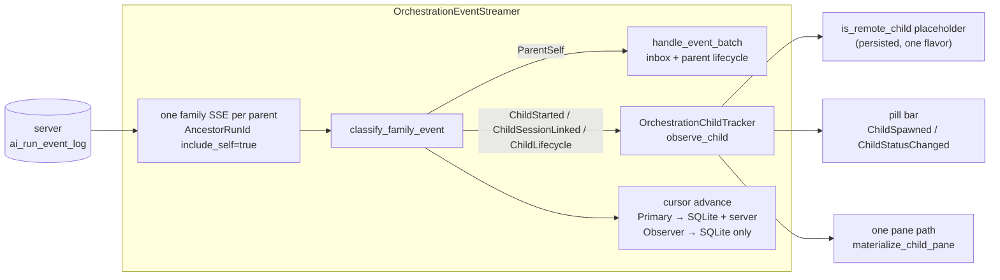

# TECH: Orchestration Child Tracking

Technical reference for how an orchestrator run discovers its child runs, how
those children are represented locally, how child panes are hydrated, and how a
cloud agent parent and its children survive a client restart.

The client system is gated behind `FeatureFlag::OrchestrationUnifiedStack`
(dogfood-only). Flag-off preserves the prior behavior; both paths live in the
same files and the differences are called out where they matter. The server
emits described in §3 are additive and unflagged.

No `warp-proto-apis` change is required: event types are Go string constants
surfaced through `public_api/openapi.yaml`, and the client deserializes
generically into `AgentRunEvent`.

## 1. Concepts and vocabulary
- **Run / task**: a server-side agent run (`ai_tasks` row) identified by a
  `run_id` (stringified `AmbientAgentTaskId`). Client-side an `AIConversation`
  may be linked to a run via `run_id` / `task_id`.
- **Parent / child**: a child run has `parent_run_id = P`. **One-level-tree
  invariant** (load-bearing): a run is either a root orchestrator or a leaf
  child. The server ancestor query is single-level (`parent_run_id = $1`),
  consistent end-to-end. Revisit alongside the server query if multi-level
  trees are introduced.
- **Family stream**: a single SSE connection per parent run with the
  `AncestorRunId { ancestor_run_id, include_self: true }` filter. It carries the
  parent's own inbox and lifecycle events plus every direct child's events.
- **Event consumer role**: `FamilyDrainMode::{Primary, Observer}`. The *Primary*
  process hosts the orchestrator conversation (local root, or the cloud
  worker's driver), consumes the parent's inbox, and writes the authoritative
  server cursor. An *Observer* watches through a shared session, drops
  parent-self events, and persists only a local cursor. This role describes
  family-event consumption and cursor responsibility only — never authenticated
  ownership, permissions, or pane capability. Authenticated task ownership does
  not change it.
- **Cursor**: each consumer tracks the last fully-handled `sequence` and resumes
  SSE from it (`since=`). Primary-side it is per-conversation
  (`ConversationStreamState::event_cursor`), persisted to SQLite and pushed to
  the server; Observer-side it is per-orchestrator
  (`OrchestratorStreamState::event_cursor`), persisted to the local placeholder
  row but **not** pushed to the server.
- **Child placeholder**: a child that is not a real local conversation is
  represented by a placeholder `AIConversation` marked `is_remote_child`,
  persisted in `AgentConversationData` (`crates/persistence/src/model.rs:1196`)
  alongside `parent_conversation_id`, `parent_agent_id`, `run_id`, `agent_name`.
  One flavor covers every discovery route.
- **Task ownership**: a run is owned by the current user when
  `task.creator.uid == current_user_uid`. Ownership gates follow-up input and
  local persistence of the parent conversation; it never grants live input.
- **Conversation access**: `ConversationAccess::{Edit, ViewOnly, Unknown}`,
  derived from conversation object permissions returned with a transcript.
  Explicit `Edit` enables the continuation presentation; `ViewOnly` and
  `Unknown` remain passive.
- **Live role**: a child shared-session join's returned `Role` is the sole
  authority for live input. Ownership cannot promote a Reader or bypass a
  failed/inaccessible join.
- **Event log + SSE**: the server keeps an append-only `ai_run_event_log` with a
  monotonic global `sequence`, a publish path (`PublishLifecycleEvent` →
  `publishAgentRunEvent`), and an SSE handler with `RunIds([...])` and
  `AncestorRunId { ancestor_run_id, include_self }` filters whose ancestor query
  JOINs the children's `parent_run_id`. Children are created through one funnel,
  `AddTask`, regardless of path (`run_agents`, Oz CLI, web API). Relevant server
  code @ 9eba7d0932: `logic/ai/ambient_agents/add_task.go` (348-388, the child
  insert), `logic/agent_lifecycle.go` (13-81, event-type constants +
  `PublishLifecycleEvent`), `logic/agent_event_publish.go` (14-79, payload +
  PubSub), `model/ai_run_event_log.go` (35-120, `InsertEvent` + ancestor JOIN).

### 1.1 Child kinds
Not every child is out-of-band; three kinds converge to differing degrees.
1. *Local in-band children* (`run_agents` local execution): real conversations
   running in this process with real hidden terminal panes — not placeholders.
   Each also holds its own child-role SSE (`RunIds([self])`) for its inbox.
2. *Cloud in-band children* (`run_agents` / `start_agent` with cloud execution):
   started by this process. `StartAgentExecutor` creates an `is_remote_child`
   placeholder up-front and stamps the run id via
   `assign_run_id_for_conversation` when the server responds.
3. *Out-of-band cloud children* (Oz CLI, web API, another client): discovered
   only through `child_agent_started` / lifecycle events; discovery creates the
   same `is_remote_child` placeholder.

Kinds 2 and 3 share one representation and one hydration path — discovery only
*creates* for kind 3, but refetch and pane hydration serve both. Kind 1 is
deliberately different (§10).

## 2. Behavioral contract
Whenever a child task is created with `parent_run_id = P` by any method, a
parent client watching `P` discovers that child within one SSE round-trip — no
polling — and surfaces its subsequent lifecycle and inbox events. Children
render as named child pills with inbox messages attributed correctly. Clicking a
child pill hydrates its pane: a live session join while the child is running, a
transcript once it is terminal, for both the orchestrator and a shared-session
observer. After a client restart, a completed cloud agent parent restores with
its transcript, its pill bar, and click-through to each child.

## 3. Server-side event emission
### 3.1 `child_agent_started`
An event-type constant in `logic/agent_lifecycle.go`, alongside the existing
`LifecycleEvent*` constants:
```go
// EventChildAgentStarted is emitted on a PARENT run when a child task is
// created with parent_run_id = <parent>. The child run id is carried in
// ref_id. This is a discovery signal, not a run status.
EventChildAgentStarted = "child_agent_started"
```
`AddTask` (`logic/ai/ambient_agents/add_task.go`) inserts the child row inside
`database.TransactionWithNoResult(...)`. The emit runs *after* that block
returns successfully, next to the other post-commit side effects, because
`PublishLifecycleEvent` both inserts and publishes and must not run inside the
caller's transaction:
```go
if params.ParentRunID != nil && *params.ParentRunID != "" {
	if _, err := logic.PublishLifecycleEvent(
		ctx,
		td.db,
		td.datastores,
		*params.ParentRunID,          // run_id the event is recorded on
		nil,                          // execution_id: the parent has none here
		logic.EventChildAgentStarted, // event_type
		&task.ID,                     // ref_id: the new child run id
	); err != nil {
		log.Warnf(ctx, "Failed to emit %s on parent %s for child %s: %v",
			logic.EventChildAgentStarted, *params.ParentRunID, task.ID, err)
	}
}
```
The emit is best-effort: a failure must not fail child creation.
`PublishLifecycleEvent` inserts into `ai_run_event_log` (assigning the monotonic
`sequence`) and publishes to PubSub/SSE. Its `resolveParentRunIDForPublish`
looks up the *parent's own* parent for routing metadata, which is `nil` under
the one-level-tree invariant.

Because the event lives on the parent run in the existing log, both filter
shapes deliver it and no schema or migration change is needed.

### 3.2 `run_session_linked`
`updateSharedSessionLink` (`logic/ai/ambient_agents/execution.go`) emits
best-effort on the **child** run after the commit, with the session UUID in
`ref_id`:
```go
if sharedSessionUUID != nil {
    if _, emitErr := logic.PublishLifecycleEvent(
        ctx, db, td.datastores,
        runID, nil, logic.EventRunSessionLinked, sharedSessionUUID,
    ); emitErr != nil {
        log.Warnf(ctx, "Failed to emit %s for run %s: %v",
            logic.EventRunSessionLinked, runID, emitErr)
    }
}
```
This removes the metadata-fetch round-trip in the attach-time window: the client
fills in a child's `session_id` straight from `ref_id` at the moment the sandbox
claims execution. The event surfaces on the child's run in the family stream for
both Primary and Observer consumers.

### 3.3 Child conversation ACL propagation
Policy: a user with access to view a parent orchestrator session has access to
view the transcripts of that session's direct children. When a child run's
conversation object is created (`UpsertAIConversationMetadata` or
`CreateThirdPartyConversation`), the *parent run's* shared session ACLs are
propagated to the child conversation in addition to the child's own session
ACLs. This gives parent-session viewers `ViewAction` on child conversation
objects so `getAndVerifyManifest`'s `ViewAction` check passes, which is what
makes the observer-side transcript branch reachable at all.

### 3.4 Compatibility
No server feature flag is used: the events are additive, and old clients ignore
unknown `event_type` values (`lifecycle_event_type_from_wire` returns `None`,
and the cursor still advances harmlessly). Consumption is gated client-side, so
the server emits are safe to ship ahead of the client.

Test coverage in the `AddTask` suite injects a mock via `getEventPubSubClient`
and asserts that a task created with `ParentRunID` set produces exactly one
published event with `event_type=child_agent_started`, `run_id=<parent>`,
`ref_id=<child>`; that a task with `ParentRunID` nil produces none; and that the
event surfaces on both a `run_ids=[P]` stream and an
`ancestor_run_id=P&include_self=true` stream.

## 4. Client architecture at a glance

One SSE per parent family. `OrchestrationEventStreamer` hosts both Primary and
Observer state: `streams` keyed by conversation for Primary,
`viewer_mode_orchestrators` keyed by `parent_task_id` for Observer (the legacy
field name is retained). Each entry carries an `OrchestrationChildTracker`,
which is the sole entry point for child state changes;
`OrchestrationViewerModel` and the Primary drain both delegate to it.

Two sources of truth are declared:
- `BlocklistAIHistoryModel` owns durable child identity and linkage
  (conversation ↔ run id, parent ↔ children).
- `OrchestrationChildTracker` owns transient orchestration state (session id,
  last state, pane materialization, in-flight fetches).

Everything else is derived. `OrchestrationViewerModel` is a thin observer-side
pane/status adapter, and `PaneGroup` owns pane lifecycle only.

## 5. The family event stream
### 5.1 Opening the stream
A root orchestrator registers for the family stream at its first
`wait_for_events`, before any child exists:
```rust
pub fn register_root_on_wait(&mut self, conversation_id: AIConversationId, ctx: ...) {
    if !FeatureFlag::WaitForEventsParentRegistration.is_enabled() { return; }
    // guards: not a child (one-level tree), not a passive remote-run view,
    // has a self_run_id ...
    let stream = self.streams.entry(conversation_id).or_default();
    if stream.ancestor_on_wait { return; }
    stream.ancestor_on_wait = true;
    stream.watched_run_ids.insert(self_run_id);
    self.reevaluate_eligibility(conversation_id, ctx);
}
```
`is_eligible` treats a wait-registered root (`ancestor_on_wait`) as having an
orchestration role, and `desired_sse_filter` selects
`AncestorRunId { ancestor_run_id: self_run_id, include_self: true }` — one
connection carrying the parent's own inbox (`new_message`), child lifecycle
events, and `child_agent_started`. The call site is `wait_for_events.rs::execute`
and the method performs **no network fetch**.

**Superset stream up front (options considered).** The cheaper-looking
alternative is to open a narrow `RunIds([self])` stream and *upgrade* to the
ancestor filter on the first `child_agent_started`. That introduces a
cursor-handoff gap: the per-conversation `event_cursor` is a single scalar over
the *global* sequence space, but a self stream only delivers run-`P` events, so
a parent-self event can advance the cursor past a lower-sequenced child event
the narrow filter never delivered; the ancestor reconnect then resumes from the
advanced cursor and skips it. Opening the ancestor (superset) stream from the
start means the filter never widens, so the cursor always covers the full
watched set. The cost — a childless waiting root holds a JOIN stream rather than
a run-ids stream — is one idle SSE either way.

A consequence worth stating explicitly: `child_agent_started` is a
discovery-latency optimization, not a correctness-critical upgrade trigger. A
child created during an already-blocked wait before the stream opens is caught
by replay from the cursor when the stream connects, so discovery is
self-healing.

**Absent run id.** When a parent or wait-root has no `self_run_id` yet,
`desired_sse_filter` returns `NoFilter` (with a warn) and defers until
`on_server_token_assigned` re-evaluates. This is safe in practice because the
run id arrives via StreamInit or task creation before the model can emit any
tool call.

### 5.2 Classification
`drain_family_events` is the single drain for both consumer roles. Each event is
classified by `classify_family_event(event, self_run_id)`:
```rust
enum FamilyEvent {
    /// Inbox message or lifecycle event on the parent's own run.
    ParentSelf(AgentRunEvent),
    /// child_agent_started on the parent run; child run id in ref_id.
    ChildStarted { child_run_id: String },
    /// run_session_linked on a child run; session UUID in ref_id.
    ChildSessionLinked { child_run_id: String, session_uuid: String },
    /// A recognised lifecycle event on a child run.
    ChildLifecycle { child_run_id: String, kind: api::LifecycleEventType },
    /// Anything else: advances the cursor only (forward compat).
    Opaque,
}
```
Classification is positional as well as type-based: discovery is recognised only
on the parent's own run, session links and lifecycle events only on other
(child) runs. A discovery or session event with an empty `ref_id` is unusable
and falls through to `Opaque`, as does a child `new_message` (the tracker cannot
act on it, and neither role has a delivery path for another run's inbox).

Fan-out:
- `ChildStarted` → `tracker.observe_child(Started)`
- `ChildSessionLinked` → `tracker.observe_child(SessionLinked { session_uuid })`
- `ChildLifecycle` → `tracker.observe_child(Lifecycle(kind))` plus the
  `ChildStatusChanged` pill-bar broadcast
- `ParentSelf` → Primary: `handle_event_batch` (inbox + lifecycle);
  Observer: dropped
- `Opaque` → cursor advance only

### 5.3 Drain mode and cursor authority
`FamilyDrainMode` is the only mode concept in the system, and it controls
exactly two things: whether parent-self events are delivered, and who owns the
cursor. Primary calls `persist_cursor_local_and_server`; Observer calls
`persist_cursor_local_only`. Preserving the split matters because a viewer that
pushed the cursor could fast-forward the owner's resume point.

`persist_event_cursor` enforces monotonicity at the call site: both
`update_event_sequence` and the server-side write are set-not-max, so the
effective sequence folds in the in-memory stream cursor and the persisted SQLite
cursor before writing.

**Observer `include_self` (options considered).** An Observer could open
`include_self=false` as a viewer-only optimization, at the cost of a second wire
shape and a second server query path to maintain. Instead both roles open the
same `include_self: true` stream and the Observer drops `ParentSelf`
client-side. The wire cost is the parent's own event volume; the benefit is one
stream shape, one cursor rule, and no "which stream saw it first" reasoning.

`handle_event_batch` (Primary) advances and persists the cursor, drops
killed-run events, and enqueues inbox messages and lifecycle items into
`OrchestrationEventService` for the parent's LLM input path
(`drain_and_convert_events`). It does **not** write child status; the tracker is
the sole status writer, which is what keeps owner-side pills current while the
child pane stays closed.

`refresh_task_data` coalesces in-flight fetches: a refetch arriving mid-fetch is
recorded and one follow-up issues on completion.

## 6. `OrchestrationChildTracker`
### 6.1 State
The tracker is **mode-agnostic**: it is constructed from a `parent_task_id`
alone and treats every child identically regardless of which side of the family
stream is consuming it. Consumer-role behavior lives entirely at the drain
level, so there is no second mode enum to keep in sync.
```rust
pub struct TrackedChild {
    /// None until execution is claimed and a session is linked.
    pub session_id: Option<SessionId>,
    pub last_state: Option<AmbientAgentTaskState>,
    pub pane_materialized: bool,
    /// false only for in-band children, which own a real local conversation.
    pub is_remote_child: bool,
}

pub struct OrchestrationChildTracker {
    parent_task_id: AmbientAgentTaskId,
    children: HashMap<AmbientAgentTaskId, TrackedChild>,
    children_by_run_id: HashMap<String, AmbientAgentTaskId>,
    in_band_children: HashSet<AmbientAgentTaskId>,
    metadata_fetches: HashSet<String>,
    pending_session_ids: HashMap<AmbientAgentTaskId, SessionId>,
}
```
`TrackedChild` deliberately holds **no conversation id**. Holding a stand-in id
invited a race in which two children briefly shared the same placeholder id; all
identity lookups instead go through `run_id` against the history model, which is
the single identity authority.

`pending_session_ids` absorbs the ordering case where `run_session_linked`
arrives before the child's placeholder exists; the id is applied at creation.

### 6.2 `observe_child`
Every way a child can become known funnels into one entry point, which makes
self-healing structural rather than a special case:
```rust
pub fn observe_child(
    &mut self,
    child_run_id: &str,
    signal: ChildSignal,
    killed_run_ids: &HashSet<String>,
    ctx: &mut ModelContext<OrchestrationEventStreamer>,
)
```
0. Drop signals for tombstoned (locally killed) runs, and for runs owned by a
   non-placeholder local conversation. The tombstone gate runs before any
   placeholder creation or pane request — including across the metadata-fetch
   await and the cancel-during-spawn race — so a killed run cannot be
   resurrected by a late event.
1. Create-or-update child membership, converging fetched task metadata through
   `BlocklistAIHistoryModel::ensure_remote_child_conversation`.
2. Write status through on `Lifecycle` signals and emit the shared status event.
3. Refetch metadata while `session_id` is missing or the pane is not
   materialized.
4. Request pane materialization once `session_id` is known, or a transcript once
   the run is terminal.

### 6.3 Signals
```rust
pub enum ChildSignal {
    Started,                              // child_agent_started
    SessionLinked { session_uuid: String },
    Lifecycle(api::LifecycleEventType),
    Seeded(Box<AmbientAgentTask>),        // REST seed / restore fetch row
    Registered,                           // created by this process
}
```
- `Started` is idempotent: an already-known child only continues hydrating.
  First sighting inserts a pending `TrackedChild` immediately — before the async
  metadata fetch completes — so later `Lifecycle` and `SessionLinked` signals
  see a known child instead of being dropped. Explicit tracker state replaces
  the older implicit `conversation_id_for_agent_id(...).is_none()` guard.
- `SessionLinked` fills in `session_id` with no metadata fetch and immediately
  requests pane materialization.
- An unknown `Lifecycle` performs the same eager membership insert and emits
  `ChildSpawned` before the metadata fetch, so lifecycle-before-started is a
  complete discovery backstop rather than a tracker-only fetch.
- `Seeded` carries a REST task row (cold-start seed or restore fetch) and is
  boxed because the row dwarfs the other variants.
- `Registered` is a unit variant: the executor marks a child it created as
  already-represented, so no placeholder is created and no discovery fetch is
  ever issued on its behalf. It carries no conversation id, for the same reason
  `TrackedChild` does not.

### 6.4 Single-writer invariants
- **Child membership has one writer.** Under the ancestor filter the wire shape
  needs only the parent's `self_run_id`, so per-child run-id sets stopped being
  filter inputs. Child membership lives in the tracker alone; the streamer's
  parent-role check and `RunIds`-fallback derivation read tracker state rather
  than maintaining `watched_run_ids` copies. `watched_run_ids` shrinks to
  self-inbox watching for the legacy fallback.
- **Child status has one writer.** The tracker maps lifecycle status and writes
  through when the durable mapping exists, for both consumer roles.
  `OrchestrationViewerModel` consumes the same broadcast and writes the
  identical status for its pane; task-snapshot registration also initializes
  status. These writes are idempotent and converge on the one history
  conversation. Local in-band children keep their own controller as their status
  authority.
- **Identity has one authority.** `ensure_remote_child_conversation` is atomic
  create-or-adopt. The placeholder-creation callback and the observer metadata
  callback may race, but both funnel through it, so exactly one named
  conversation populates `agent_id_to_conversation_id`.

## 7. Child identity and persistence
One persisted placeholder flavor covers all child kinds, and the on-disk shape
stays backward-compatible by reusing existing fields:
- `is_remote_child: bool` in `AgentConversationData` is the persisted marker for
  "child placeholder without a local run". Rows written by older builds already
  carry it.
- Observer-ness is a runtime property of the drain, not a persisted conversation
  flavor. Observer-discovered placeholders persist with the same marker, which
  is what makes child restore and run-id attribution work after a restart.
- Server-status-report suppression keys off `is_remote_child` rather than
  `is_viewing_shared_session()`.

`is_viewing_shared_session` survives only for the *parent* viewer placeholder,
which is a genuine shared-session concept rather than a child representation.
The two flags now overlap heavily — both mark conversations that are local
stand-ins for a remote run reached over the shared-session protocol, differing
only in which code path created them — and a module-level TODO on the tracker
records the intent to merge them into one `is_remote_placeholder` flag so every
placeholder persists uniformly.

**Compatibility.** Old builds restore rows written by new builds and vice versa.
Observer-created child rows look like ordinary child placeholders to old builds,
which is acceptable: they render as pills, and click-through degrades to
transcript-when-terminal. New builds restoring old rows simply see no
observer-discovered children. No migration is needed.

## 8. Child pane hydration
### 8.1 The materialization decision
`decide_child_pane_materialization(&task)` is a free function (unit-testable
without a `PaneGroup`) that maps observable task state to one of three actions:
```rust
pub(crate) enum ChildPaneMaterialization {
    /// Attachable live session — join it in place using `session_id`.
    AttachLive { session_id: SessionId },
    /// No live session but a server conversation token is available.
    LoadTranscript { server_token: ServerConversationToken },
    /// Neither yet; leave the pane pending until task data changes.
    Pending,
}
```
Only terminal runs load a transcript, and empty/whitespace tokens are treated as
absent because they would otherwise drive a no-op cloud fetch.

"Pending" is not bespoke machinery: it is simply a tracked child whose pane is
not materialized, re-driven by `observe_child` and by the shared `TasksUpdated`
subscription.

### 8.2 One dispatch for every child
Three functions make up the unified path:
- `materialize_child_pane(child_conversation, ctx)` — outer dispatch. Looks up
  task data via `get_or_async_fetch_task_data`; a cache hit is synchronous, so
  this adds no network cost in the common case. While the fetch is in flight it
  shows the child loading presentation (rather than the generic cloud-agent
  composing zero state) and registers the child in `pending_child_hydrations`.
- `apply_child_pane_materialization(child_conversation, task, ctx)` — inner
  dispatch on `decide_child_pane_materialization`.
- `materialize_viewer_child_pane_from_task(child_id, task, ctx)` — thin adapter
  for the observer, which supplies a pre-fetched task snapshot. It keeps the
  idempotency guard (skip when the child already has a live tracked pane) and
  then delegates to the inner dispatch.

All three are idempotent with respect to `child_agent_panes`: repeat calls for a
child that already has a live pane are skipped rather than creating a duplicate
pane and orphaning the first.

**Why origin is not a capability gate (options considered).** An earlier shape
carried a `ChildPaneOrigin::{HostedConversation, SharedSession}` tag through
materialization, on the theory that a pane built from an orchestrator-hosted
conversation and one built from a shared session need different treatment. In
practice both arms ran the same ownership check, called the same access
resolution, and routed to the same continuation/passive presentation, so the
parallel structure expressed a distinction the code did not actually make.
Capability comes from two other places entirely: the joined shared-session
`Role` for live input, and `ConversationAccess` for a completed transcript. The
tag was therefore removed rather than threaded through: origin is not carried in
the pending map, not passed to the attach or transcript functions, and not used
to choose a loading placeholder. The residual construction difference between
the two former arms — which `TerminalManager` constructor to use — was resolved
by making one constructor correct for all child panes (§8.3).

### 8.3 Live attach
`attach_ambient_orchestration_child_session(child_id, session_id, ctx)` is the
single live-attach path for child panes. It replaces any loading pane already
showing for the child, and swaps the replacement into the same anchor only once
its session manager, ambient model, and conversation are initialized, so a
half-built pane is never visible.

It builds the pane through `create_ambient_orchestration_child_pane`, which uses
`TerminalManager::new_for_ambient_orchestration_child`. That constructor
combines two properties that were previously mutually exclusive:
- `is_ambient_agent = true` — the ambient model exists at construction time,
  ambient session events are wired, and the pane uses
  `TerminalModel::new_for_cloud_mode_shared_session_viewer`.
- `orchestration_child_conversation_id = Some(conversation_id)` — routes
  `FailedToJoin` through `OrchestrationChildSharedSessionJoinFailed` →
  `recover_viewer_child_join_failure` instead of surfacing a generic toast.

Making both universal has three consequences. Every child pane now has join
recovery, closing a gap where an orchestrator-side child pane showed a toast
with no retry. Every live child pane shows ambient context (environment,
harness) even for a collaborator. And because `is_ambient_agent` is universal,
`handle_viewer_session_end` routes all child session ends through
`end_current_ambient_session`, which checks `owned_ambient_agent_task_id` and
sets `NotShared` (editable, follow-up input visible) for owners and
`FinishedViewer` (read-only) for collaborators — the desired behavior, since an
owner may legitimately continue a child task as a standalone cloud conversation.

The cost is one extra `get_ambient_agent_task` round trip per collaborator per
child pane, from `enter_viewing_existing_session`, to resolve harness and
environment for the ambient UI. At the observed fan-out of 2–8 children this is
acceptable. That call also writes the child task's model preference into
`LLMPreferences` scoped to the pane's `terminal_view_id`; the write is
pane-scoped, not global, and already happened for orchestrator-side child panes.
It emits no `ExecutionSessionReady` and performs no server write-back.

Collaborators can see (and click) the harness and environment selectors, but
`set_harness` / `set_environment_id` only mutate local state, and follow-up
input remains ownership-gated through
`resolve_cloud_conversation_continuation_ui_state` →
`owned_ambient_agent_task_id`, so there is no path for such a selection to be
acted on.

`new_for_orchestration_child` is unchanged and still serves the flag-off path.

### 8.4 Transcript
`hydrate_child_transcript(pane_id, child_id, task_id, server_token, ctx)` is the
single transcript path. It loads the cloud conversation by server token and then
applies two staleness guards before touching the pane, because the fetch is
async and the pane may have been superseded in the meantime:
1. `pane_id` must still be the canonical pane for `child_id`.
2. The pane's terminal view must still be displaying `child_id`.

Both guards are applied unconditionally. The second was previously
observer-only; it is harmless where the pane is already canonical, and cheaper
than reasoning about which callers can race.

Non-Oz outcomes are handled per variant rather than collapsed, so a CLI-agent
transcript and an empty fetch produce distinct warnings instead of one ambiguous
bail-out.

On success the cloud transcript is merged into the placeholder via
`hydrate_remote_child_placeholder_with_cloud_transcript`, and presentation is
chosen by `completed_child_presentation(access, blocks_cloud_followups)`:
- `ConversationAccess::Edit` on a task whose source permits cloud follow-ups →
  `replace_child_loading_with_continuation_pane` (the established ambient
  cloud-mode continuation presentation).
- `ViewOnly`, `Unknown`, or a source that blocks follow-ups (GitHub Action,
  GitHub webhook) → `restore_child_passive_transcript`.

A missing task is treated as blocking follow-ups, so an unresolvable task can
never widen capability.

### 8.5 Pending and stale sessions
One map, `pending_child_hydrations: HashMap<AmbientAgentTaskId,
AIConversationId>`, holds every child awaiting fresher task data, and one
function, `process_pending_child_hydrations`, drains it from the shared
`TasksUpdated` subscription. Origin is not stored, because after §8.2 no arm
consults it.

`failed_viewer_child_sessions` is the stale-session guard and applies to every
child pane. Its rule: never re-attach to a `session_id` that already failed to
join. When the guard fires, the child is re-queued as pending and the pane is
marked live-unavailable rather than retried; when a fresh `session_id` appears,
the guard entry is cleared and attach proceeds.

`recover_viewer_child_join_failure` records the dead session, re-queues the
child, marks the pane live-unavailable, and calls
`AgentConversationsModel::evict_and_refetch_task`. Recovery is bounded by
construction: each retry costs one refetch round trip, the guard prevents
re-attaching the same dead session, and once the task reaches a terminal state
the entry leaves the pending map through the `LoadTranscript` arm.

Loading placeholders are created directly through
`create_child_loading_placeholder(child_conversation,
AgentViewEntryOrigin::CloudAgent, ctx)`. All child panes are cloud agent
children regardless of which side of the family stream discovered them, so the
per-side wrapper functions that differed only in entry origin were removed.
Entering agent view is what makes the pill bar render; the loading view keeps the
output area a spinner until hydration completes.

### 8.6 Determining ownership
Ownership is `task.creator.uid == current_user_uid`.

**Options considered.** A richer `TaskScope` / `TaskOwnership` model
(tri-state ownership resolved from an authoritative user/team `scope` on the
task payload, with creator equality as a compatibility fallback) was built to
handle team-owned runs whose creator is a service account UID. It was then
dropped in favor of the simple creator check: `blocks_cloud_followups` is true
only for GitHub Action and GitHub webhook sources, so the Linear/Slack/CLI runs
that motivate the team-scope case are not blocked on that axis, and the team
service-account scenario is plausible but unconfirmed in practice. Carrying a
second ownership model — deserialization, resolution, and test coverage — to
serve an unconfirmed case is a poor trade against a check the flag-off path
already used. The scope model is straightforward to restore if a concrete gap
surfaces; the reintroduction point is `owned_ambient_agent_task_id` and
`task_ownership_access`, which are the only consumers.

Note the layering this preserves: ownership decides persistence (§9.2) and
follow-up input. It does not decide live input (the joined `Role` does) and it
does not override an explicit `ConversationAccess::ViewOnly`.

## 9. Cloud agent parent conversation restore
### 9.1 The failure mode
After a client restart, a restored cloud agent parent pane showed its transcript
but an empty orchestration pill bar and no child panes; pill-bar clicks and
keyboard orchestration navigation were dead. Two independent causes:

- **The parent conversation was never persisted.** Joining a cloud agent's
  shared session flags the parent conversation `is_viewing_shared_session`, and
  `write_updated_conversation_state` early-returned for any such conversation,
  so nothing was written to the `agent_conversations` table; the pane snapshot
  held only `task_id`. The flag exists to stop third-party viewers from
  persisting the host's conversation. For a `/cloud-agent` run the user *is* the
  owner: the flag is correct in form (they joined over the shared-session
  protocol) and wrong in effect.
- **The parent conversation id therefore changed on every restart.** With no
  local row, `get_or_set_canonical_conversation_id_for_server_token` minted a
  fresh `AIConversationId`. Children *were* persisted with
  `parent_conversation_id = OLD_ID`, but the pill bar reads
  `children_by_parent[NEW_ID]`.

The live-session path masked this: when the parent run is still in progress at
restart (`InProgress` + `is_sandbox_running` + a valid `session_id`), restore
rejoins the live session, `NetworkEvent::JoinedSuccessfully` constructs an
`OrchestrationViewerModel`, and its ancestor REST seed rediscovers every child.
That path never runs for a completed run.

### 9.2 Persisting the owner's view of their own run
`write_updated_conversation_state` skips persistence only when the conversation
is a shared-session view that the current user does **not** own:
```rust
// We should not persist non-local conversations (e.g. shared sessions),
// unless the run belongs to the current user.
if self.is_viewing_shared_session && !self.is_owned_cloud_agent_conversation(ctx) {
    return;
}
```
`is_owned_cloud_agent_conversation` requires the flag, a `task_id`, an
authenticated user, and cached task data whose `creator.uid` matches. It returns
false when task data is not yet cached; that is safe because the task is fetched
before the session is joined and before content arrives, so any early
unpersisted update is superseded by the next write.

**Options considered.** The alternative to persisting was a per-restore repair:
leave the parent unpersisted and rebuild the index at restore time by re-keying
the persisted children off `parent_agent_id` (the parent's server `run_id`,
which *is* stable across restarts). It was rejected because it treats the
symptom. A conversation id that changes every restart is the underlying defect,
and anything else keyed on it — the local cursor row, pane snapshots, child
rows, future features — keeps drifting; the repair would have to be invoked from
every path that reads the index, and would have to keep working forever. Making
the id stable fixes the class of problem once.

A second alternative was a narrow, serde-defaulted `is_durable_observer_parent`
marker written when the observer model resolved the parent as owned. That works,
but it adds a persisted field whose only job is to encode a fact — "the current
user owns this run" — that is already derivable from cached task data, and it
must be kept in sync with the ownership check anyway. Conditioning the existing
skip on ownership needs no new field and no migration.

`is_viewing_shared_session` stays set on the parent, which is correct for every
other behavior it gates: navigation exclusion (cloud agent conversations are
surfaced through the pane, not the conversation list), timing derivation from
server message timestamps, user-input reconstruction from server messages (the
prompt was not sent locally), and skipping search-subagent temp-dir cleanup (the
run is server-side). The observer restore skip in `on_restored_conversations`
also remains acceptable: completed runs rebuild the pill bar from the
conversation index and the `task.children` seed (§9.4), and live runs construct
the observer model at `JoinedSuccessfully`.

### 9.3 Loading-pane restore action
Persisting the parent changes which action restore resolves. An owned cloud
agent conversation that now exists locally resolves through
`AgentConversationsModel::resolve_open_action` to
`WorkspaceAction::RestoreOrNavigateToConversation` — a local-conversation
navigation action — instead of `OpenConversationTranscriptViewer`. That action
cannot be applied to an ambient loading pane, so without handling it the pane
fell through to the catch-all arm and was replaced with an empty new cloud
conversation.

`ambient_pane_restoration.rs` handles it explicitly. The transcript load is
factored into `restore_pane_with_transcript` (which returns `false` when the
pane's terminal view is not yet available, so the caller can requeue), and the
`RestoreOrNavigateToConversation` arm:
1. If the conversation already has a terminal surface, it is open elsewhere;
   replacing the loading pane with a new cloud conversation avoids showing the
   same conversation on two surfaces.
2. Otherwise the transcript is loaded from the server token carried on the task
   (`task.conversation_id()`).
3. Only a task with no conversation id falls back to a new cloud conversation.

### 9.4 Seeding children from `task.children`
Restoring from the local index only works where a durable per-user SQLite
database survives across sessions and already holds a parent row. The WASM web
client shares this Rust codebase but has no such database: `app/build.rs` sets
the `local_fs` / `local_tty` cargo features only when `target_family != "wasm"`,
and `crates/persistence` gates its SQLite implementation behind `local_fs`. On
web there is no `agent_conversations` table across sessions, so
`get_or_set_canonical_conversation_id_for_server_token` can never find a prior
row and `initialize_historical_conversations` has nothing to index. For an Oz
session link opened on web, rebuilding the relationship from server data is the
only mechanism that can populate the pill bar.

`AmbientAgentTask.children` — the `Vec<String>` of direct child `run_id`s
returned by `GET /agent/runs/{run_id}` — is that server data. No server change
is required.

**Where it runs.** `load_data_into_restored_ambient_cloud_mode_view` is the
single funnel for restoring a cloud agent parent into a cloud-mode pane, reached
both by native session restore
(`replace_loading_pane_with_restored_ambient_cloud_mode_pane_inner`) and by the
web / deep-link transcript load (`load_data_into_transcript_viewer`). It is an
associated function running inside an active `PaneGroup` update, so it cannot
re-enter the view to touch `PaneGroup` state. It therefore **returns** the
`Option<AIConversationId>` it already computes, and each `&mut self` call site
invokes the seeding entry point immediately afterwards. The rejected alternative
— capturing a weak handle and calling `update` from inside the associated
function — is a re-entrant view update.

**The seeding pass.** `seed_child_conversations_from_task(parent_conversation_id,
parent_task_id, ctx)` in `child_agent/restoration.rs`:
- Returns immediately when the flag is off.
- Resolves the parent task through `get_or_async_fetch_task_data`; a fetch in
  flight leaves the parent in `pending_parent_child_seeds` for the next
  `TasksUpdated`.
- Treats an empty `children` list as "nothing to add" (older servers, or a run
  with no children) and clears the pending entry.
- Resolves the parent's terminal surface once, outside the loop: it is
  loop-invariant, and if the parent has no surface now a `TasksUpdated` will not
  change that, so it warns once and leaves the entry pending rather than
  repeating the warning per child.
- For each child run id: parses it (a malformed id is warned and skipped, not
  retried), resolves the child's task data (a fetch in flight keeps the parent
  pending), and calls `ensure_remote_child_conversation` with the child's
  display name, trimmed title, and harness derived by `agent_task_harness`
  (widened to `pub(crate)` so the derivation is shared rather than duplicated).
- Clears the pending entry only when every child resolved; otherwise re-queues.
- Materializes hidden child panes when the parent's pane is resolvable, then
  notifies. Pills render straight off the conversation index, and
  `ensure_hidden_child_agent_pane_for_conversation` materializes lazily on
  click, so an unresolvable parent pane is not an error.

`process_pending_parent_child_seeds` re-invokes the same function for each
pending snapshot from the shared `TasksUpdated` subscription.

**Why `ensure_remote_child_conversation` rather than a relinking pass.** The
other way to repair the index is a startup pass that finds persisted children
whose `parent_agent_id` matches the restored parent's run id and rewrites their
stale `parent_conversation_id`. That option was rejected on three grounds. It
only works where the children were persisted locally, so it does nothing for the
web client — the case that most needs a fix. It introduces a second writer of
parent↔child linkage, competing with the create-or-adopt authority that
discovery already uses, and therefore a second place where the linkage
invariants can drift. And it must rewrite existing rows, which means reasoning
about partially-migrated state. Routing the seed through
`ensure_remote_child_conversation` keeps one writer: the function returns the
existing conversation when `conversation_id_for_agent_id(run_id)` already
resolves, and on the create path goes through `start_new_child_conversation` →
`set_parent_for_conversation`, which stamps `parent_conversation_id` and inserts
into `children_by_parent` — exactly what the pill bar reads
(`descendant_conversation_ids_in_spawn_order`). Re-running the seed, or racing
the SSE family drain, costs nothing.

No separate reconciliation step exists for stale links. Persistence and seeding
ship together, so every run created under the flag keeps a stable parent
`AIConversationId` across restarts and the persisted children's
`parent_conversation_id` already matches.

### 9.5 Convergence and degradation
With the parent persisted, restore proceeds:
1. `get_or_set_canonical_conversation_id_for_server_token` finds the existing
   row and returns the **same** `AIConversationId` as the previous session.
2. The children's persisted `parent_conversation_id` still matches.
3. `initialize_historical_conversations` rebuilds
   `children_by_parent[stable_parent_id]`.
4. The pill bar reads the populated index and renders child pills.
5. `restore_missing_child_agent_panes_for_parent` drives child pane hydration,
   which fetches each child's task data and updates the pill badge through the
   normal `process_pending_child_hydrations` / `hydrate_child_transcript` path.

Seeding from `task.children` fires on the same restore and converges on the same
`children_by_parent` state from server data, which is what makes steps 1–3
optional. The two mechanisms are order-independent and idempotent: whichever
populates the index first, the other collapses to a no-op, and a child that is
both persisted locally and reported by the server yields exactly one pill.

Degradation is quiet in every failure mode: an empty `children` list is a no-op;
a failed parent or child task fetch is bounded by the task cache's in-flight
dedupe and failure cooldowns and retries on later `TasksUpdated` events without
replacing or destroying a pane; and with the flag off the seeding entry point
returns immediately.

## 10. What stays deliberately un-unified
- **Local (same-process) in-band children.** Their conversations, terminal
  panes, and child-role inbox SSEs (`RunIds([self])`) are real and unchanged.
  The tracker treats them as already-represented — no placeholder, no metadata
  fetch — and only their lifecycle status flows through it for pill updates.
- **The wake-only listener** for dormant local Claude children
  (`DormantClaudeWakeConsumer`): a different lifecycle problem, and a candidate
  for the family drain only if local child inbox delivery moves there too.
- **The parent viewer placeholder** (`is_viewing_shared_session` on the
  orchestrator conversation itself): a shared-session concept, not a child
  representation.
- **The flag-off hydration path**: `hydrate_task_backed_hidden_child_pane`,
  `attempt_remote_child_hydration`, `decide_remote_child_hydration_action`,
  `hydrate_remote_child_transcript_in_place`,
  `attach_ambient_session_and_maybe_tombstone`,
  `process_pending_remote_child_hydrations` (with its
  `pending_remote_child_hydrations` map), and
  `ensure_shared_session_viewer_child_pane` remain intact so flag-off behavior
  is untouched.

## 11. Retired mechanisms
Discovery and streaming:
- `FeatureFlag::OrchestrationViewerStreamer` and
  `FeatureFlag::OwnerOrchestrationAncestorStreamer` (fully rolled out) and all
  their usage sites.
- The legacy viewer REST polling path: `fetch_children`, `schedule_next_poll`,
  `maybe_kick_polling`, `apply_children_fetch`, and their interval constants.
- Both separate drain pipelines — `drain_sse_events` and
  `drain_ancestor_events` — replaced by `drain_family_events`, along with
  `register_children_from_events`,
  `ensure_placeholders_for_child_lifecycle_events`, and
  `trigger_child_task_refreshes`, all subsumed by `observe_child`.
- Per-child run-id sets as SSE filter inputs.
- The second (`is_viewing_shared_session`) child-placeholder flavor for new
  writes. The observer model no longer creates conversations of its own; its
  fetch and status handlers are thin pane-state adapters over the history
  model's mapping.
- The tracker-level consumer-role enum, superseded by `FamilyDrainMode` at the
  drain.
- `TrackedChild.conversation_id` and the executor's conversation-id stamping
  (`stamp_conversation_id_for_run`).

Pane path:
- `decide_remote_child_hydration_action` and `RemoteChildHydrationAction` on the
  unified path (retained for flag-off), `settles()`, and
  `process_pending_remote_child_hydrations`' flag-on branch.
- `live_attach_ambient_session_to_pane`, `attach_child_session`,
  `attach_owner_child_session`, and `attach_viewer_child_session`, converged
  into `attach_ambient_orchestration_child_session`.
- `materialize_owner_child_pane` / `materialize_viewer_child_pane`, converged
  into `materialize_child_pane` + `apply_child_pane_materialization`.
- `hydrate_owner_child_transcript` /
  `hydrate_viewer_child_transcript_in_place`, converged into
  `hydrate_child_transcript`.
- `create_owner_loading_child_placeholder` /
  `create_viewer_loading_child_placeholder`, inlined to
  `create_child_loading_placeholder` with `AgentViewEntryOrigin::CloudAgent`.
- `process_pending_viewer_child_hydrations` and
  `pending_viewer_child_hydrations`, merged into
  `process_pending_child_hydrations` and `pending_child_hydrations`.
- `ChildPaneOrigin`, `TaskOwnership`, and `TaskScope`.

## 12. Empirical grounding
Validated against a healthy session-sharing server, the three click-timing cases
behave as follows:
- **Early click (Queued/Pending)**: the child is not attachable for ~10s and the
  pane re-drives as the task advances. `run_session_linked` fires at sandbox
  claim and fills in `session_id` directly, with no metadata fetch.
- **Running click**: a single immediate `AttachLive`.
- **Completed click**: a single terminal `LoadTranscript`, for orchestrator and
  observer alike.

## 13. Validation
Automated:
- `cargo nextest run -p warp --no-fail-fast`, `./script/format`, and clippy
  (`-D warnings`) must pass. Run native and WASM checks; if WASM fails before
  compiling Warp code due to the local C/clang target, record that pre-Warp
  toolchain blocker explicitly.
- Flag off: prior behavior is preserved; the two drain paths remain,
  observer-discovered children are not persisted.
- Flag on: `drain_family_events` is the sole drain, `observe_child` the sole
  entry point for child state, and observer-discovered children persist as
  `is_remote_child = true`.
- `observe_child` idempotency: two `Started` signals for one run id issue
  exactly one metadata fetch.
- Tombstoned-run skip: `observe_child(Lifecycle)` for a killed run is a no-op.
- `Registered` prevents placeholder creation for in-band children.
- `SessionLinked { session_uuid }` fills in `session_id` without a fetch.
- `classify_family_event`: all five variants, including the empty-`ref_id` and
  wrong-run-position cases.
- Cursor authority: an Observer drain advances the cursor without pushing to the
  server; an authenticated owner observing through a shared link is still an
  Observer (no parent-self delivery, no server cursor write).
- Completed child presentation: Edit → continuation pane; ViewOnly/Unknown →
  passive transcript; a follow-up-blocking task source forces passive.
- Live role: a Reader cannot send input; executable roles can. Ownership does
  not affect this.
- Pane-path branch selection, stale terminal session, bounded
  `SessionNotFound` / `FailedToJoin` recovery, and the
  empty-transcript/no-compose presentation.
- Restart-restore: an owned cloud agent parent restores from its ambient pane
  task id with its persisted local cursor and reconstructs named child pills
  from persisted `is_remote_child` rows. App-state tests cover both running
  shared-session selection and terminal existing-conversation restoration with
  exchanges and no compose zero state.
- Owner-side pill status updates while the child pane stays closed.

Manual (dogfood, flag on, server emits deployed):
1. Create a child via Oz CLI or web API with `parent_run_id` while the parent is
   in `wait_for_events`; verify it surfaces without polling latency as a named
   pill with attributed messages.
2. Click a child pill at each of the three lifecycle moments (early/Queued,
   running, completed) and verify re-drive, live join, and transcript
   respectively.
3. Start a cloud agent via `/cloud-agent`, have it run 2+ remote children to
   completion, then restart the client. Verify the parent restores as a
   transcript view, the pill bar shows one pill per child with the correct final
   status badge, and each pill reveals the child pane with its transcript.
   Restart a second time to confirm the parent was written to the database on
   first restore rather than synthesized from a live session.
4. Open the same completed run's Oz session link in the web client. The pill bar
   and children must appear; this exercises the `task.children` seed in
   isolation, since the web build has no SQLite.
5. Restart while a cloud agent is still running: the pane must rejoin the live
   session and show pills.
6. Confirm no duplicate pills for a run whose children are both persisted
   locally and reported in `task.children`.
7. With children running, verify each child pane shows ambient controls, that
   follow-up input appears for owned child panes after the session ends, and
   that a collaborator viewing the shared parent session sees ambient UI but no
   follow-up input.
8. Force a stale/expired child `session_id` and verify `FailedToJoin` triggers
   recovery (the pane retries on the next task update) rather than a toast.
9. With the flag off, repeat the shared-session-with-children and
   restart-after-completion cases and confirm prior behavior.

Observability: counters and logs for placeholder creations, metadata-fetch
failures, and family-stream opens per mode, so a flag-on regression appears in
dogfood telemetry rather than only in bug reports.

## 14. Risks
- *Observer regression*: the observer model is load-bearing; flag-off is
  identical to the prior baseline and all pre-existing tests stay green.
- *Cursor authority*: a shared stream must preserve the Observer's read-only
  cursor, or an observer could fast-forward the orchestrator's resume point.
- *One-level-tree invariant*: discovery assumes direct children. Preserve
  `register_root_on_wait`'s child guard and revisit alongside the server JOIN if
  multi-level trees arrive.
- *Forward/backward compat*: old clients ignore `child_agent_started` and
  `run_session_linked`; the cursor advances harmlessly. The server emits are
  safe to ship before the client.
- *Kill tombstones*: `observe_child`'s step 0 is the sole tombstone gate and
  runs before any placeholder creation or pane request, including across the
  metadata-fetch await and the cancel-during-spawn race.
- *Reconciliation SSE churn (known transient)*: dropping a stale placeholder in
  `assign_run_id_for_conversation` emits removal events whose run id the
  streamer prunes from every watched set — including a parent mid-claim for its
  real local child. For a single-child parent this tears down and reopens the
  parent SSE (the executor's `register_watched_run_id` re-adds it);
  drain-before-teardown prevents data loss and the cursor is preserved, but
  correctness leans on the emission order of three history events. Re-pointing
  should become explicit (prune the run-id index without treating it as child
  death) rather than relying on event ordering.

## 15. Follow-ups and open questions
- **Single task-metadata fetch authority.** Two paths still learn child task
  metadata: the streamer's placeholder-creation path fetches the child task so
  it can create a named history row, while the tracker and pane hydration ask
  `AgentConversationsModel` for task state. Both are idempotent and converge
  atomically through `ensure_remote_child_conversation`, but they can duplicate
  requests and maintain overlapping snapshots. `AgentConversationsModel` — the
  only one with in-flight dedupe, failure cooldowns, a cache, and a
  `TasksUpdated` signal — should become the sole fetch authority, with
  placeholder creation, tracker state, and pane materialization re-driving from
  that cache.
- **One status-mapping module.** Child status exists in three representations —
  wire `event_type`, REST `AmbientAgentTaskState`, client `ConversationStatus` —
  with mappings that mirror each other across files and a separate
  `is_terminal_run_state()` consulted by hydration. One mapping module owned
  alongside the tracker would replace the mirror-comment contract with a single
  function set.
- **One cold-start seed.** The post-restore fetch, the REST ancestor seed, and
  wait-time registration are all "fetch children, merge cursor, install" with
  different retry and cursor-merge logic. `ChildSignal::Seeded` exists to make
  them one mode-agnostic seed routine.
- **Deduplicate local-child event delivery.** With the parent's family stream
  open, every local in-band child's events already arrive in this process — and
  arrive again on that child's own `RunIds([self])` stream (disjoint
  consumption: the parent takes lifecycle, the child takes its inbox). N local
  children means N+1 connections carrying overlapping data. Folding child inbox
  delivery into the family drain would collapse this to one connection, and the
  dormant-Claude wake listener would become a drain classification case instead
  of a third connection type. Complication: each child's own per-run server
  cursor must still advance, or be explicitly retired.
- **Merge the placeholder flags.** `is_remote_child` and
  `is_viewing_shared_session` differ only in which path created the placeholder;
  a single `is_remote_placeholder` (with a serde alias for compatibility) would
  let every placeholder persist uniformly and retire the last conditional in the
  persistence path.
- **Child registry consolidation.** Child identity and live state remain split
  across the history model, the tracker, the observer model, and `PaneGroup`,
  held together by explicit idempotency guards at each boundary. The target
  shape is history as durable identity, tracker as transient event state,
  observer model as a thin adapter, and `PaneGroup` as pane lifecycle only.
  Defer until dogfood behavior stabilizes and the real invariants are visible.
- **Seed pagination.** The cold-start REST seed caps at 100 children (server
  cap); fine at current fan-out, but the unified seed should define behavior
  beyond it.
- **Live child authorization for non-owners.** Parent-to-child *live* access is
  a separate future server policy. Today a successful child shared-session
  join's returned role is authoritative: Reader stays read-only, executable
  roles may send input, and ownership never overrides Reader,
  `SessionNotAccessible`, or a join failure. `SessionNotFound` is treated as a
  stale/missing session signal — evict and refetch task state, then transition
  to transcript if the run is terminal.
